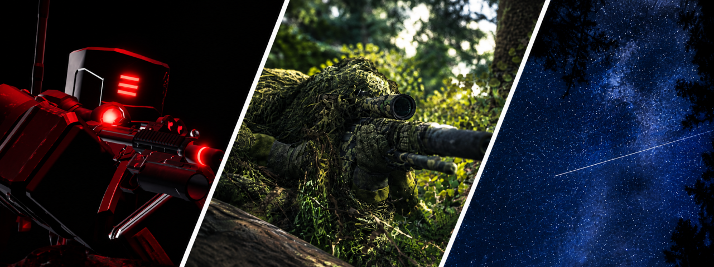
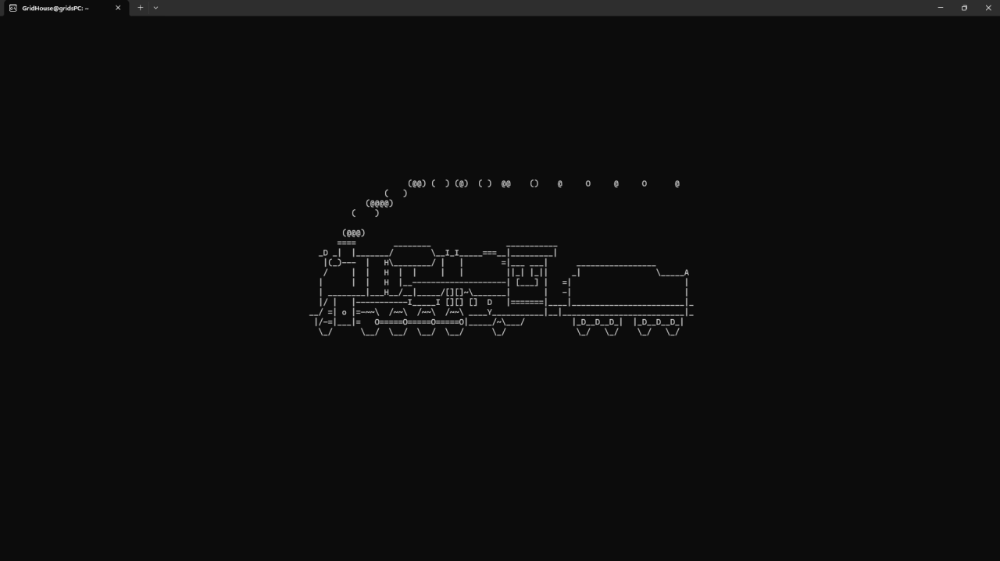
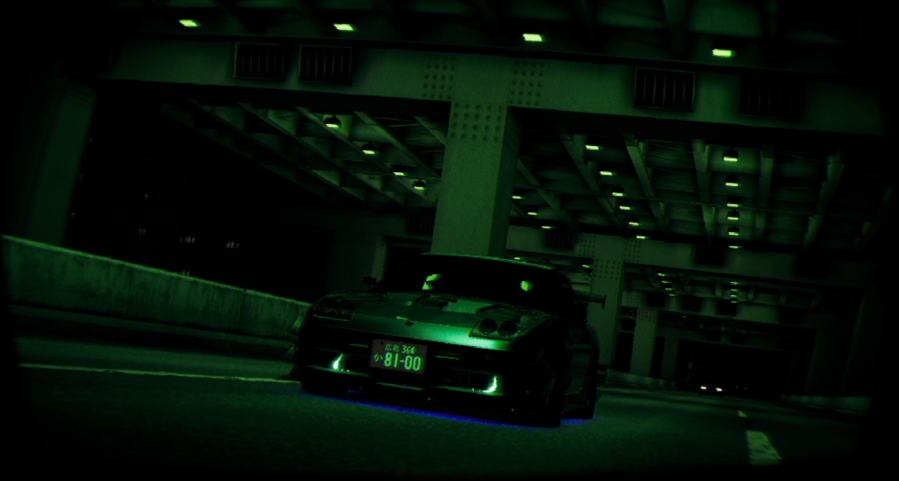
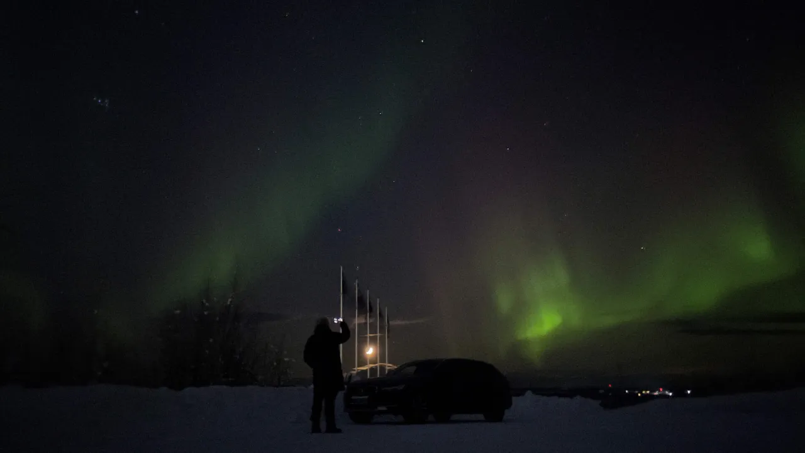

  

# GridHouse - officially an idiot.
🇪🇪 Estonian - L1 | 🇬🇧 English - C1

*Sometimes a photographer, sometimes a wisdom speaker - mostly a dumbass with a gun.*

Online, I'm known as GridHouse, and if you're lucky enough to get to know my real name, you're most likely someone I know in real life.

On a 4-year course to become an IT System Specialist.

<i>pssst... if you wanna find more about me, then this <a href="https://gridhouse.notion.site/GridHouse-2374936ecc3f80878a9bc2a6b829aa62">shiny blue text</a> will take you there.</i>

---

 

  

## Studies

The obvious part: I finished elementary.
Not so obvious part: Studying to become an IT System Specialist at VOCO for 4 years.

### What do those studies contain?
- Cybersecurity
- Scripting
- Whole bunch of bullshit regarding Windows Servers (which I hate)
- Networking
- That one penguin
- etc. etc. etc...

---

 

## Photography

  
  

In my free time, I take pictures. Anything from animals to nature itself to architecture, so on and so forth.
For example: the two photos above this text. One is from a game called NIGHT-RUNNER PROLOGUE, the other is from my time in Northern Sweden, Kiruna.

**And there are a lot of photos I've taken.**
